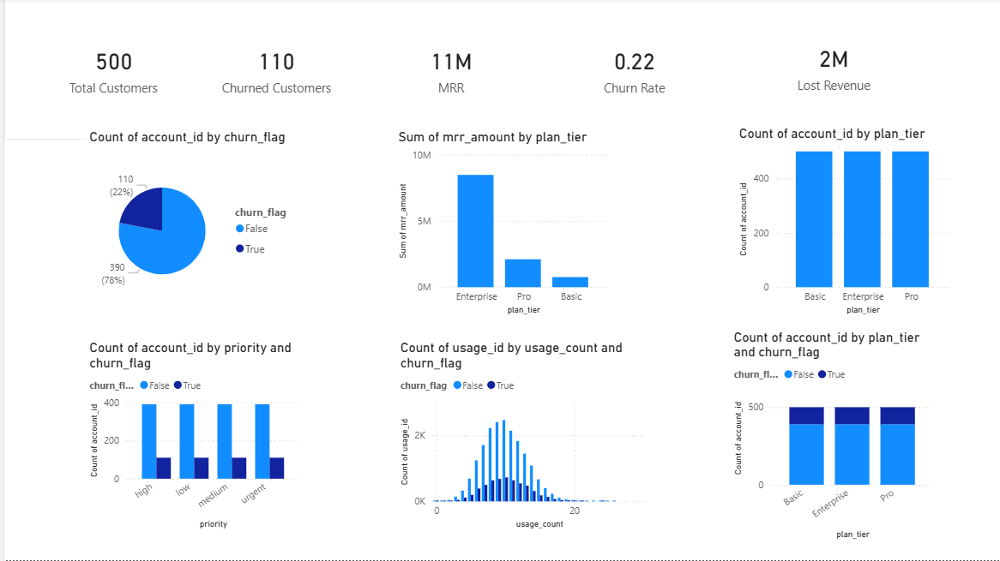

# SaaS Customer Churn & Retention Analysis

## 📌 Project Overview
This project analyzes customer churn behavior in a SaaS business using a multi-table dataset.

## 🎯 Objective
To identify churn patterns, retention drivers, and revenue impact.

## 🛠 Tools Used
- Power BI
- Excel

## 📊 Key Metrics
- Total Customers: 500
- Churn Rate: 22%
- MRR: 11M
- Lost Revenue: 2M

## 🔍 Key Insights
- 22% of customers churned, indicating moderate retention challenges
- Enterprise plan generates the highest revenue
- Low usage customers show higher churn tendency
- Support tickets are correlated with churn

## 💡 Recommendations
- Improve onboarding for new users
- Increase feature engagement
- Enhance support response time
- Focus on high-value customers

## 📷 Dashboard

## 📁 Dataset
Synthetic SaaS dataset (RavenStack)

